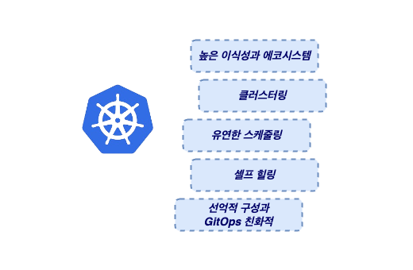

회사에서 쿠버네티스 기반으로 서비스를 약 1년정도 운영 중인 상태입니다. 2024년의 비즈니스 목표는 **‘우리 Platform을 Boxing하여 고객사에 딜리버리 하고 운영하는 것’**이었습니다.

**목표:**

> 실제 고객사의 보안 요구사항을 충족 시키며 **“우리 Platform을 ‘전달’ 하고 ‘운영’ 해야 한다.” (No Inbound Only OutBound)**
>

**돌아보면:**

이 문제를 해결해야 할 때쯤인 23년 후반기에 팀장님 새롭게 오셨습니다. 새로오신 팀장님의 주요 커리어는 클라우드와 쿠버네티스였고 팀장님이 쿠버네티스를 잘 아신다는 이유로 쿠버네티스를 이용해 해결하고자 했습니다. 결론적으로 총 2개의 고객사에 쿠버네티스를 기반의 플랫폼 Boxing하여 딜리버리하였고 프로젝트를 성공적으로 운영하여 25년에도 다른 프로젝트들을 함께하게 되었습니다.  

하지만 이 글의 트리거 라고 볼 수 있는데 지금 생각해보면 아쉬운 점이 존재합니다. **“왜 쿠버네티스를 사용했나요?”** 라고 질문한다면 논리적으로 대답하기 어렵고 스스로도 납득하기도 어렵습니다. 따라서 이 글을 작성하며 조금더 학습하며 앞으로  0 → 1 을 넘어 1 → 10 경험을 쌓을 수 있게 노력해볼 예정입니다.

## **쿠버네티스란 무엇인가?**

먼저, 쿠버네티스란 무엇이고 어떤 문제를 해결하기 위해 등장한 기술인지 알아보고자 합니다.

> *Kubernetes is an open-source container orchestration system for automating software deployment, scaling, and management*  
> by Wiki

쿠버네티스에 대한 정의를 위키 백과에서는 ***“소프트웨어의 자동화된 배포와 스케일링 그리고 운영을 위한 오픈 소스 컨테이너 오케스트레이션 시스템이라 정의합니다.”***  즉, 쿠버네티스는 자동화된 컨테이너 운영 관리 도구인 것입니다. **‘오케스트레이션’** 이란 키워드가 등장하는데 그렇다면 오케스트레이션이란 무엇이고 보편적인 자동화와는 어떤 차이가 있기에 오케스트레이션이란 단어를 사용할까요?

### **Automation vs Orchestration**

**Automation 은 무언가를 새롭게 ‘배포’하고 메트릭을 ‘감지’ 하는 것에 집중합니다.**  즉, 자동화는 손쉽게 배포하고 이상 지표를 자동으로 감지할 수 있는 시스템을 만드는 것까지가 목표입니다. 하지만 운영/관리를 위해서는 보편적인 자동화로는 한계가 존재하는데 보편적인 자동화만으로는 이상 지표가 감지 되었을 때, 적절한 ‘후속 조치’를 사람이 진행해야 한다는 한계가 있습니다.

**[수동 조취 케이스]**

1. 컨테이너 내려간 경우, 서버에 접근하여 문제 있는 컨테이너를 제거하고 다시 컨테이너를 올려주어야 한다.
2. 트래픽 증가로 인한 부하가 늘어나는 경우, 수동으로 컨테이너 수를 증가시킨다.

이처럼 서비스를 운영 시 문제가 생겼을 때 후속 조취 작업은 필수인데 이러한 작업이 ‘사람’에 의존적이라면 실수할 여지가 있으며 이는 곧 ‘ 서비스 품질이 사람에 의해 바뀔 수 있다는 것입니다.’ **보편적인 자동화는 한계가 있고 이는 우리가 추구하는 완벽한 의미에서 자동화는 아닙니다. 따라서 O*rchestration*은 후속 조치에 대한 것까지 자동화 해주는 것을 목표로 등장하였고 컨테이너 환경에서는 필수적인 기능들이 되었습니다.**

쿠버네티스는 오케스트레이션 도구로서 ‘Self Healing’ 을 통해 컨테이너를 지속적으로 정상 상태로 복구시켜주고 부하가 늘어나 처리량이 떨어지면, HPA를 통해 ‘Auto Scaling’**을 셀프로** 진행합니다. 이렇게 **쿠버네티스는 사람이 진행하던 ‘후속 조취’를 자체적으로 제공하기 때문에 휴먼 에러로 인한 품질이 저하가 발생하지 않으며, 보다 완벽한 자동으로 제공하기 때문에 엔지니어의 운영 코스트를 절감 시켜 다른 생산적인 작업에 리소스를 투입할 수 있게 해줍니다.**

### 그 외 어떤 도구들이 있을까?

쿠버네티스는 컨테이너를 오케스트레이션 하는 도구이며 쉽게 생각하면 컨테이너 관리 도구입니다. 따라서 컨테이너 관리를 위해 꼭 쿠버네티스만을 사용해야 하는 것은 아닙니다. 오히려 단순 컨테이너를 관리하는 것이 목적이면 꼭 쿠버네티스를 사용할 필요는 없으며 대표적으로 아래의 대안들이 존재합니다.

1. Docker Compose
2. Docker Swarm
3. AWS ECS
4. 서버리스 서비스들

이렇게 가장 간단한 Docker Compose 부터 AWS의 ECS 그리고 다양한 서버리스 제품들까지 대안이 존재합니다. 실제로 저희도 Docker Compose만으로 간단한 3tier architecture를 사용했었습니다. 하지만 Docker Compose 만으로는 위 문제들을 해결할 수 없었고 컨테이너 기반으로 서비스를 더 잘 운영하기 위해선 쿠버네티스가 많은 도움을 준다고 생각하여 쿠버네티스를 도입하였습니다.

추가로 클라우드 환경이라면 컨테이너 오케스트레이션 도구로 AWS ECS 또한 강력합니다. 하지만 ECS는 결국 AWS 의존성이 높고 이식성이 떨어지며 쿠버네티스의 서비스와 같은 로드밸런서의 부재로 컨테이너 레벨에서 로드밸런싱과 서비스 디스커버리 측면에서 한계가 뚜렷합니다.

---

## 그렇다면 무엇이 쿠버네티스를 표준으로 만들었고 우리가 쿠버네티스를 사용하는 이유!

대안들이 존재하지만 쿠버네티스는 컨테이너 오케스트레이션 표준이되었다. 무엇이 컨테이너 오케이스트레이션 도구에서 표준으로 자리 잡게 했을까요?

1. **높은 이식성과 쿠버네티스 에코시스템:**
    1. 쿠버네티스를 사용하면 다양한 클라우드 환경 및 온프레미스 환경에서도 일관된 방식으로 애플리케이션을 배포하고 운영할 수 있게 해줍니다.
    2. 쿠버네티스는 CNCF에서 관리하는 오픈소스이기 때문에 기능들이 빠르게 확장되고 있으며 커뮤니티기반의 강력한 에코 시스템을 확보했습니다. 이러한 에코 시스템들은 운영에 대한 코스트를 낮춥니다.
2. **클러스터링:**
    1. 쿠버네티스는 Control Plane, Data Plane으로 크게 두 가지 클러스터링을 지원합니다. 따라서 하나의 노드가 Down되어도 나머지 정상 노드를 활용해 비즈니스를 가동시킬 수 있습니다.
3. **유연한 스케줄링:**
    1. 쿠버네티스는 단순한 스케줄링이 아니라 Node의 상태에 따라 최선의 스케줄링을 하고자 노력합니다.
    2. 쿠버네티스는 Application의 특성을 고려해 유연한 스케줄링을 제공합니다. 예를 들어 AI 기능이 필요하다면 GPU가 설치된 노드에 배치하는 것이 가능하며, 토폴로지를 제공해 내결함성을 높일 수 있습니다. 
4. **손쉬운 네트워크 관리:**
    1. 쿠버네티스는 CNI 플러그인이라는 가상의 네트워크를 활용해 컨테이너간 통신 컨테이너에 IP 할당 등등 다양한 네트워크 문제를 외부 의존성 없이 자체적으로 해결할 수 있게 지원합니다.
5. **서비스 디스커버리와 로드 밸런싱:**
    1. Pod들이 동적으로 생성되고 소멸되기 때문에, 서비스 간 통신을 IP 기반이 아닌 DNS 기반으로 통신할 수 있게 지원합니다.
    2. 쿠버네티스는  로드 밸런싱을 이용해 Reliability를 높일 수 있는데, Not Ready 상태의 Pod들은 트래픽에서 자동으로 제외시켜 고객의 실패 경험을 최소화 시킬 수 있습니다. 
6. **셀프 힐링과 오토스케일링:**
    1. 내부적으로 제어루프 개념이 존재하기 때문에 Pod가 죽었을 때와 같이 Desired State에서 달라졌을 때 자동으로 Pod를 생성하는 등의 **현재 상태가 목표 상태와 일치하도록 시스템을 조정**하는 방식으로 작동한다.
    2. Application의 처리량이 떨어져 Latency가 늘어난다면 HPA, VPA를 사용해 탄력적인 스케일 인/아웃 을 지원합니다. 나아가 Node의 Resource Pressure에도 Cluster Autoscaler를 사용해 노드 자체도 동적으로 조절할 수 있습니다.
7. **볼륨 관리:**
    1. PV와 PVC를 분리하여 스토리지 기술과 애플리케이션의 커플링을 줄입니다. 이를 통해 컨테이너는 Row Level의 Storage 기술에 종속적이지 않고 PVC 만을 사용해 유연하게 볼륨을 구축할 수 있습니다.
    2. 이러한 특징은 이식성을 높이며, 비교적 비용이 높은 Raw Level의 기술 변경에도 안정성을 제공합니다. 
8. **최적화된 GitOps:**
    1. 쿠버네티스는 Desired State를 유지하고자 합니다. 또 이러한 Desired State는 YAML 파일을 사용하여 선언적인 방식으로 관리됩니다.
    2. 따라서 형상 코드의 형태로 (IaC) Git을 **Source of Truth로** 이용해 관리하며 손쉬운 롤백과 히스토리 추적을 지원하여 신뢰성을 높일 수 있습니다.

이러한 매커니즘들은 결국 컨테이너 환경에서 서비스를 운영할 때 고민해야하는 것들입니다. 이러한 고민들에 대한 해답을 쿠버네티스가 가장 잘 지원하기 때문에 쿠버네티스가 핵심이자 표준이 되었다 생각합니다.

---

## 다시 생각해보는,  ‘우리는 왜 쿠버네티스를 선택했나’

위에서 쿠버네티스가 무엇이고 왜 표준이 되었는지 쿠버네티스의 강점들을 정리했습니다. 물론 쿠버네티스가 ‘실버 불릿’은 아니기 때문에 트레이드 오프가 발생하지만, 지금 다시 의사결정을 하라고 해도 쿠버네티스를 선택할 것 같습니다. 그렇다면 왜 그런 선택을 할지 한 번 정리해보겠습니다.

만약, 지금 다시 의사결정을 해야 한다면 Docker Swarm과 비교해볼 수 있을 것 같습니다. Docker Swarm은 Docker engine에 내장되어있는 Cluster management, Orchestration Tool이며 Kubernetes 처럼 클러스터링을 지원하며 어느정도의 셀프 힐링도 지원합니다. 하지만 도커스웜은 소규모 서비스에 적합하다 라는 내용을 쉽게 볼 수 있습니다. 왜 그럴까요?

### **[도커 스웜의 한계점]**

1. **서비스 신뢰성을 보장하기엔 부족한 기능들:** 서비스의 신뢰성을 위해선 ‘고가용성’과 ‘확장성’이 중요한 포인트입니다. 도커 스웜은 컨테이너 레벨에서의 복구를 지원하지만 많이 부족합니다. (PDB도 없음)
무엇보다 컨테이너에 대한 `Health Check`, `Readiness` 기능이 없기 때문에 컨테이너가 비정상적으로 동작하고 있어도 트래픽은 그대로 전달되기 때문에 고객의 트래픽이 지속적으로 실패할 수 있습니다. 반면, K8s는 자동으로 비정상 파드를 트래픽 대상에서 지워 실패 경험을 최소화 합니다. 
    
    또, 노드 레벨에서 장애가 났을 때 조취하는 것이 부족합니다. 쿠버네티스는 `Unready` 상태의 노드가 발견되면 즉시,  정상적인 상태의 노드로 파드의 스케줄링을 다시합니다. 이렇게 K8s는 신뢰성을 높일 수 있는 여러가지 자동화 매커니즘이 존재하지만 도커 스웜은 부족합니다.
    
2. **부족한 리소스 타입:** `StatefulSet`**,** `DaemonSet`, `Job` 등등 쿠버네티스에는 단순 컨테이너를 넘어 컨테이너를 활용해 보다 다양한 종류의 서비스를 운영할 수 있습니다. 컨테이너는 Stateless 하다는 특징이 있는데 이는 큰 장점이지만 단점이 될 때도 있습니다. 예를 들어 DB 같은 서비스는 Stateful 해야 하며 Stateful한 리소스들의 고유성을 보장하고 몇번을 스케줄링해도 동일한 노드에 스케줄링 해줍니다. 하지만 도커 스웜은 이러한 기능들이 존재하지 않아 애플리케이션 성격에 따라 유연한 대처가 불가능합니다.
3. **부족한 배포 시스템:** Kubernetes에는 `Deployment` 를 이용해 `RollingUpdate`를  기본적으로 지원합니다. Docker Swarm도 service update로 가능하지만 세밀한 제어가 부족합니다. 쿠버네티스는 graceful down을 지원할 수 있으며, `maxUnavailable` 를 통해 최소로 유지할 파드를 선언해, 서비스의 순단을 방지합니다. 
4. **스케줄링 유연도가 떨어진다:** 쿠버네티스는 어피니티를 통해 선호하는 곳으로 컨테이너를 스케줄링할 수 있게 도우며 토폴로지를 지원해 분산 배치를 지원 하지만 도커 스웜에는 이러한 기능이 없습니다. 나아가 Resource에 대한 Request가 없어 최소한의 자원을 보장받는 것도 어렵습니다. 또, Node가 Pressure를 받을 경우, Evict 되어야할 필요가 있는데 이 경우, QoS 클래스라는 개념을 이용해 Evict 우선 순위를 결정하여 주요 서비스의 컴퓨팅 리소스를 최대한 안전하게 지킬 수 있습니다.

이렇게 도커 스웜은 많은 부분에서 오케스트레이션 도구의 표준이 되기 어려운 형태입니다. 이러한 부족함은 고객사의 폐쇄망에 서비스를 전달하고 운영하는데 있어 신뢰도를 갖추기 어렵다. 판단됩니다. 따라서 지금에서 의사결정을 해도 쿠버네티스를 선택할 것 같습니다.

---

## 어떤 트레이드 오프를 가져야할까? - 앞으로의 숙제

지금까지 쿠버네티에 대해 정리하고 도커 스웜과 비교하며 쿠버네티스 라는 의사결정 배경을 고민해봤습니다. 아시겠지만 쿠버네티스를 도입했다고 끝이 아닙니다. 쿠버네티스는 복잡도가 높으며 특히나 EKS처럼 Managed가 아니기 때문에 많은 부분을 신경써야만 보다 안정적인 운영이 가능해집니다.

1. **가시성을 높여야합니다.**
    1. 비즈니스를 담당하는 애플리케이션의 가시성, 클러스터 운영의 Core인 `Control Plane` 에 대한 가시성 모두 챙겨야합니다. 관리하는 Workload들이 늘어날 수록 `Control Plane` 의 부하는 높아지고 Control Plane이 죽으면 전체 장애로 이어집니다.
2. **물리 머신 레벨에서도 최대한 무중단를 지원해야 합니다.**
    1. 쿠버네티스 버전 업, 노드의 장애로 인한 교체 과정에서 비즈니스는 자체가 완전히 멈추는 것을 피하고자 최대한 무중단을 지원할 수 있어야 합니다.
    2. 이를 통해 클러스터에 대한 MTTR를 높이고 SLA를 준수할 수 있게 노력해야 합니다.

---

## 마무리

지금까지 머리속에 뒤죽박죽으로 있던 것들을 정리해봤습니다. 이 과정에서 처음 목표 했던 Why에 대한 답변도 생긴 것 같습니다. 특히, 도커 스웜의 한계점을 명확히 이해하고 우리가 왜 쿠버네티스를 선택해야 했는지 보다 명확해진 시간이었던 것 같습니다. 

앞으로는 쿠버네티스 클러스터 구축의 모범 사례도 학습하며 우리의 약점들을 어떻게 보완할 수 있을지 고민해보도록 할 예정입니다.